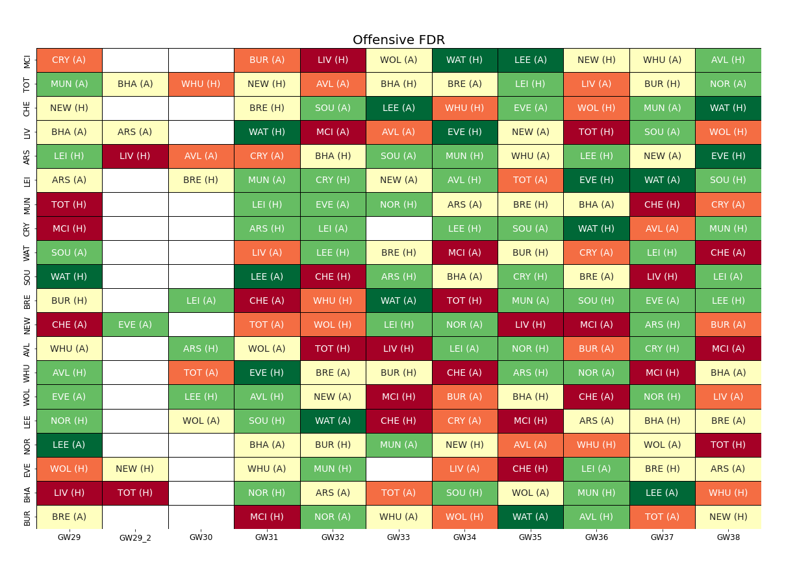
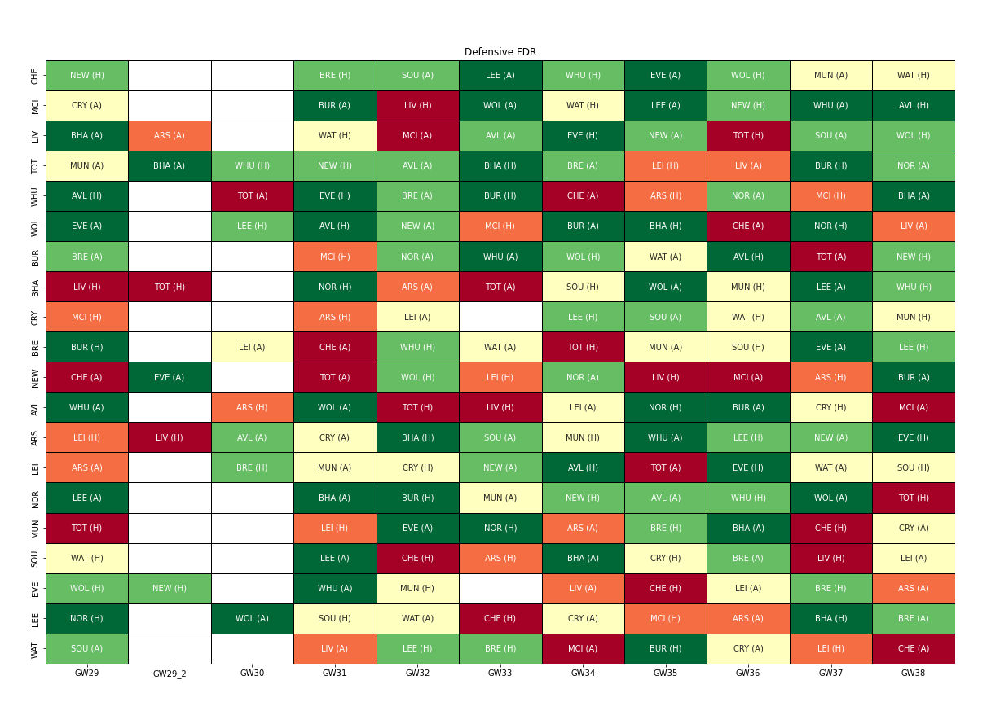
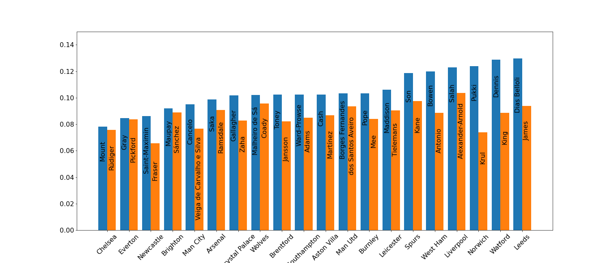

# Fixture Difficulty Rating
Fixture Difficulty Rating (FDR) is one of the most useful tools to plan player transfers in FPL. The idea is to quantify the toughness of competition a team will face in their upcoming games which will give an estimate of how easy it will be for a team to score or keep a clean sheet. FPL provides an "official" FDR [here](https://fantasy.premierleague.com/fixtures/fdr), however it has a few shortcomings:
1. It does not separate between offense and defense.
2. Values are not updated very often
3. Some of the values appear to be off

For a discussion of these issues, see **ADD LINK** 

## My Approach
My FDR is based purely on xG/xGA. For a detailed discussion, see **ADD LINK**. The scale goes from dark green (low defensive strength) to dark red (high defensive strength), denoting how easy or hard it is to score against that opponent. On the y-axis, teams are sorted by offensive form, best to worst.

Although there is no direct mapping from FDR values to expected goals, I use this as a more or less accurate guide:
- Red: Hard to score 1 goal.
- Orange: Maybe 1 goal.
- Beige: Probably 1 goal, maybe 2.
- Green: Probably 2 goals.
- Dark green: 3+ goals likely.

Note that for double gameweeks (DGW), teams are not necessarily in the right order. 

Below is the corresponding "Defensive FDR", denoting how easy/hard it will be to avoid conceding against a certain team. Like the Offensive FDR, teams on the y-axis are sorted by defensive form, and the colors go from dark green (low offensive strength) to red (high offensive strength). Against a dark green team, there is a good chance to keep a clean sheet, while against a red team it will be a great challenge.

# Points, Goals, and Assists

The below graph shows the two highest FPL-points haulers for every team as a fraction of a team's FPL points. This is useful in showing what player in each team tends to score the best. Moreso, we can clearly see that for some teams there are one or two standout performers, while for other teams the points are more evenly spread out. Leeds is a particularly good example. Even though the team is not performing very well this season, they can still score a few goals, and particularly against weaker opposition. The chart below tells us that Raphinha is by far the player who picks up the most points for Leeds. In other words, should Leeds score, there is a good chance Raphinha is involved.

On the other side of the spectrum, Chelsea have been incrediby diverse this season with a plethora of different goalscorers and various players coming in and out of form (and injury). Indeed Rüdiger, whose majority of points come from clean sheets, is the second highest point scorer for Chelsea. Thus, even though Chelsea are a very well-performing team, it is hard to know which of the players is likely to be involved in attacking output.

Go [here](./GvxG.html) to see some fun stuff.

